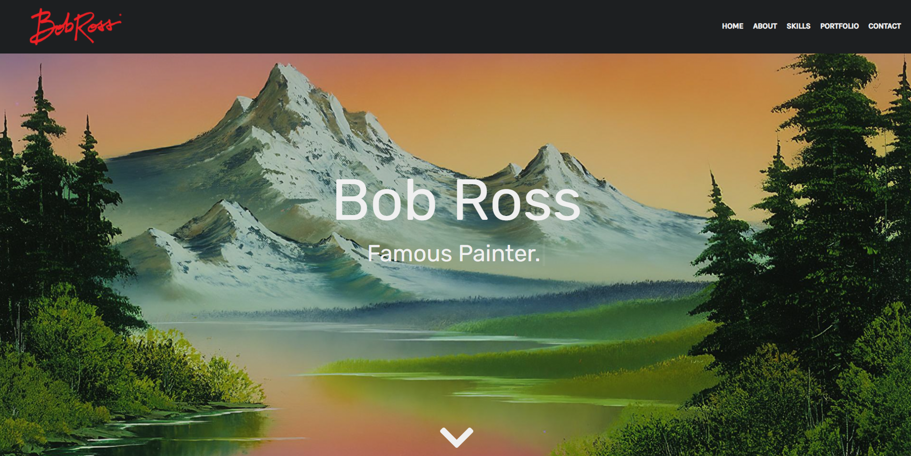
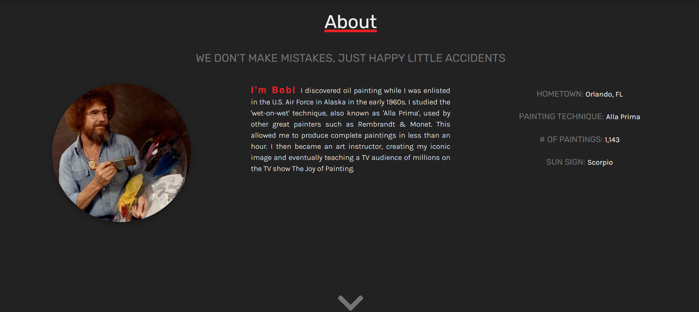
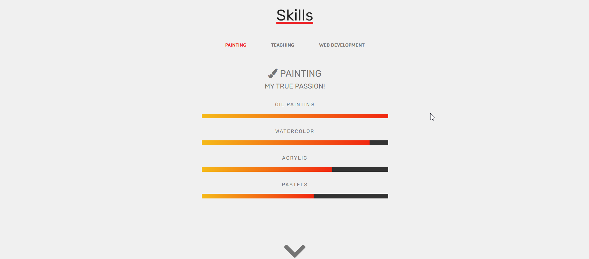
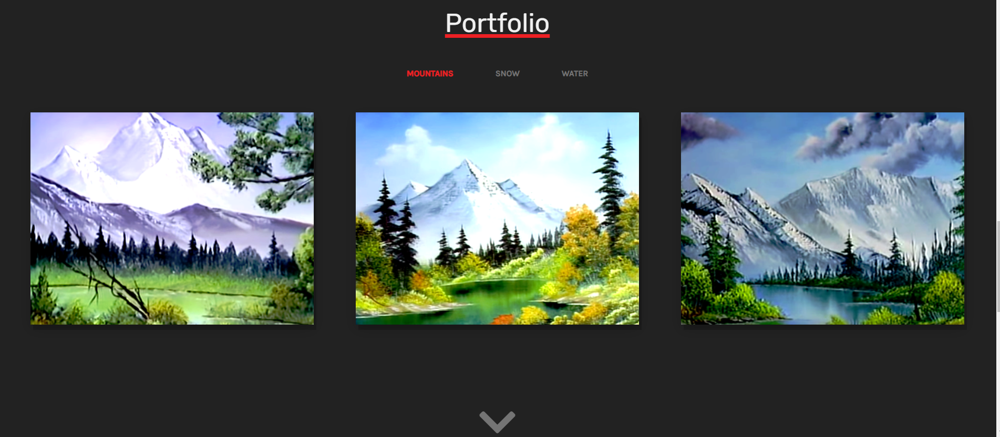
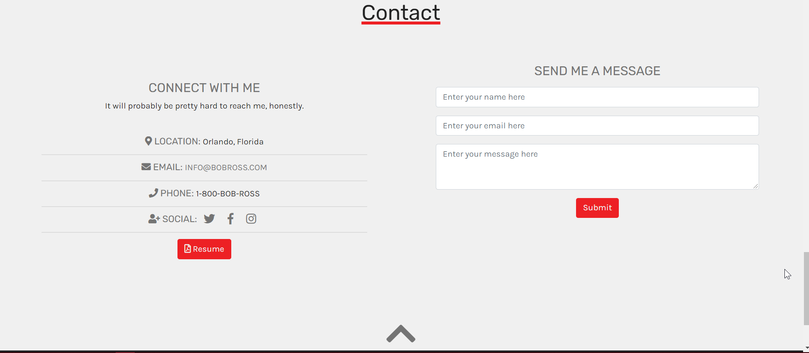

# Portfolio Template 🚀

    

### Live Demo: https://vue-portfolio-template.netlify.app/

_Disclaimer: This is not the real Bob Ross or affiliated with him in anyway. Duh._

# :gear: Description

This is a developer portfolio template built with **Vue.js**. Knowledge of Vue is not required to use this template! Simply follow these instructions carefully to properly populate your own portfolio data.

> This template is fully mobile-responsive!

I made this README extremely detailed, but I promise getting setup is easy-peasy!

# :hammer_and_wrench: Install & Setup

## Get Up & Running :running:

1. Fork the repo
2. Clone the new repo to your machine
3. Run `npm i` to install dependencies
4. Run `npm run serve` to start the development serve
5. View your portfolio at `http://localhost:8080`

## Making It Yours (TLDR;) :sparkles:

1. Update all of the [Images](#content):

- replace `favicon.ico`(or delete)
- replace `header-background.jpg`
- replace `logo.png` (or delete)
- add images to the `potfolio/`directory

2. Update the [Content](#content) from the `.json` file

3. Create a [contact form](#form) using [99inbound](https://app.99inbound.com/)

4. Update the [Styling](#styling) by updating Sass variables

## Lay of the Land :desert_island:

- Favicon is stored in `/public/favicon.ico`
- All other images are found in `/src/assets/images`
- Your content will be updated from `/src/data/data.json`
- You can update basic styling such as colors by updating the variables explained in `/src/styles/scss/abstract/_variables.scss`
- Update `index.html` with a title and meta descriptions
- You should fill everything out unless it's indicated as _optional_

  > If you choose not to fill out an _optional_ item, then leave it blank in `data.json` with an empty string `""`

# :pencil: Details for Populating Portfolio

## Meta :gear:

Steps

- In `/public/index.html` you will see `<meta>` properties commented out. Uncomment them and fill them out as apporiate (_optional_)

> Necessary if you plan on making your portfolio searchable in Google and optimizing for SEO.

- Similarly, fill out the `<title>` tags with your name or a title of your choice.
  

## Images :camera:

### Favicon

Steps

- Delete the existing favicon.ico (Note this sometimes takes a while to update on the development server)

- Replace favicon.ico in the `/public` directory with your own favicon (_optional_)

> The Favicon needs to be in a `.ico` format. If you have a `.png` you would like to use you can convert it to `.ico` with an online converter such as this one [here](https://icoconvert.com/).

### Logo

Steps

- Delete `logo.png` from the assets folder

- Add a new `logo.png` file (_optional_)

> If you do not add another logo.png, you first & last name will display in the 'navbar-brand' area

### Other Images

**All other images can be found in `src/assets/images`**

> Be sure to keep the same filename and extension for the header-background, profile-pic, & logo.

- In the portfolio folder, add photos to represent your projects

> Naming your files with readable filenames is good practice for SEO.

**Recommended Sizes**

- `header-background.jpg` - A large hero image, at least 1200px wide, but no larger than 1900px.
- `profile-pic.png` - This should be a 1:1 aspect ratio. It will be reduced to 300px.
- `/portfolio` - Recommended aspect ratio of 5:3

## Content :pencil2:

- Nearly all text content is populated via `/src/data/data.json`

_The majority of the properties should be self-explanatory. I have outlined some details below._

### Main

Properties (Click to expand)

- **"titles"** - Refers to the typewriter effect in the hero. Enter an unlimited amount of strings in the array.

- **"logo"** - `true/false`: Enter `true` if you have populated a `logo.png` file. Enter `false` if you prefer to display your first & last name. If you deleted `logo.png` this **must** be **false**.

- **"headings"** - these populate the h1 for each section (eg. "About", "Skills", etc.)
  

### About

Properties (Click to expand)

- **"tagline"** - Include an h2 under the h1 in your About section (_optional_)

- **"facts"** - This is an array of objects. You can enter an unlimited amount of items here, with the recommended max being 6. These populate as list items as key-value pairs in the About section.
  

### Skills

Properties (Click to expand)

- **"defaultCategory"** - This is the skill category that will display when the page loads. This must match one of the categories listed exactly. There should not be duplicate categories (required).

* **"categories"** - This is an array of objects and you can add an unlimited amount of objects. Each "category" will appear as a filter in the Skills section. Categories should be unique.
  - **"category"** - You can break your skills up by category (eg. Front-End, Back-End, etc.)
  - **"faClass"** - add classes for a [Font Awesome](https://fontawesome.com/) icon to represent the category

- **"subtitle"** - Add a blurb about the category (_optional_)

* **"skillsList"** - This is an array of objects. These populate as "skill bars" for each skill category. Enter a _"name"_ for the skill (eg. HTML, CSS, Javascript, etc.) and a _"level"_
  - The **level** should be a value of 0-100 in a multiple of 10 (ie. 100, 90, 80, etc) that represents the width the bar will be filled for each skill.

> Reccommended max: 4 skills in each skill list to keep the section height within the viewport.

> Tip: The skill names are rendered via HTML. You could group similar skills together and separate them with an HTML entity.

> - _Example: `'Javascript &bull; jQuery'` --> Javascript &bull; jQuery_

### Portfolio

Properties (Click to expand)

- `"defaultFilter"` - similar concept to the default category in the skills section. This will be the category of projects displayed by default.

- **"projects"** - This is an array of objects and there can be unlimited objects. Recommended 3 projects per filter.

  - **"image"** - ensure this filename/extension mataches exactly the image to use from `/src/assets/images/portfolio`
  - **"link"** - The main link to the project when clicking on the image, such as the live demo
  - **"filter"** - Which filter the project should show under.

* **"source"** - add a link to the source code of your project (_optional_)
  

### Contact

Properties (Click to expand)

- **"resumeLink"** - This is where the resume link will go which appears as a button. It's recommended to use a PDF, such as a view only link to Google Drive.
- **"social"** - Social accounts are an array of objects to produce icons that link to your social accounts. Enter an unlimited amonut of objects, and enter at least one.
- **"text"** - appears as a subtitle above the contact information
- **form** - `true/false` - true requires additional setup. false will center the contact information.
  - if you do not want to use a contact form, you will still need to [remove the placeholder form](#remove-placeholder)
- **formTitle** - add a title above your contact for (\_optional)

## **IMPORTANT SETUP FOR CONTACT FORM** :email:

Because this is a static website, we use a third party to handle form requests.

There can be many ways to do this, but below is a way you can do it in just a few minutes.

### Setup account & form

Steps

1. Go to https://app.99inbound.com/
2. Create a free account (note: use the email you want to receive contact messages to to sign up as you cannot change this after creating your account)
3. Go to Forms > New Form
4. Build out your form
5. Recommended to use Name, Email, and Message fields
6. Go to Publish
7. Under the "Embed in your website section", Copy the provided div ONLY

   > The script is already included in the `index.html` file

   

### Remove placeholder form 

Steps

8. Go to `/src/pages/Contact.vue`
9. Delete the placeholder `<form>` as indicated by the comments

### Add the new form

Steps

10. Add the copied code from 99inbound to the location as indicated by the comments in `Contact.vue`
11. Add the recommended style attribute to the div

# :art: Styling

This project uses SASS / SCSS.

- Easily update basic styling such as colors from `/src/styles/scss/_variables.scss`

- Only update the other partials if you know what you're doing

> In `src/styles/scss`, there are a number of folders and .scss files
>
> All of the files appended with `_` are imported into the `main.scss` file
>
> These get compiled into `src/styles/css/main.css` which is where the site css comes from

- In a terminal instance, run `npm run sass` to watch for changes to scss files and compile them into css

# :star: Credits

- [Bootstrap](https://getbootstrap.com/docs/4.4/getting-started/introduction/)
- [Font Awesome](https://fontawesome.com/)
- [99inbound](https://www.99inbound.com/)
- [Vue.js](https://vuejs.org/v2/guide/)
- [SASS](https://sass-lang.com/)
- [Animate On Scroll Library](https://github.com/michalsnik/aos)
- [This codepen](https://codepen.io/joxmar/pen/NqqMEg) to highlight active navbar items
- [Typewriter effect](https://www.npmjs.com/package/typewriter-effect)
- [Jonas Schmedtmann](https://codingheroes.io/) for teaching me about Sass
- www.bobross.com for the content

> I spent a lot of time on this project and would love if you kept credit to me in the footer. But if not, no hard feelings! :yellow_heart:

# :scroll: License

# :thumbsup: Feedback?

> Please be sure you've followed the instructions in this README.

If something you've populated in `data.json` doesn't look quite right, let me know so I can fix it for you and others!

If you have constructive feedback for how I can improve this template, please let me know!

## Contact :telephone_receiver:

### Darian Nocera

**Email:** [hello@dariannocera.com](mailto:hello@dariannocera.com)

  

---

#### Copyright &copy; 2020 [Darian Nocera](https://www.dnocera.com)
